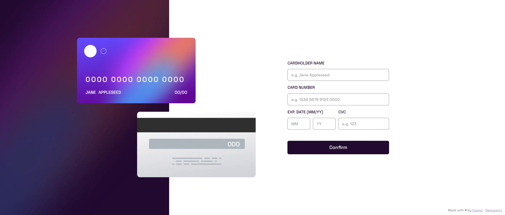
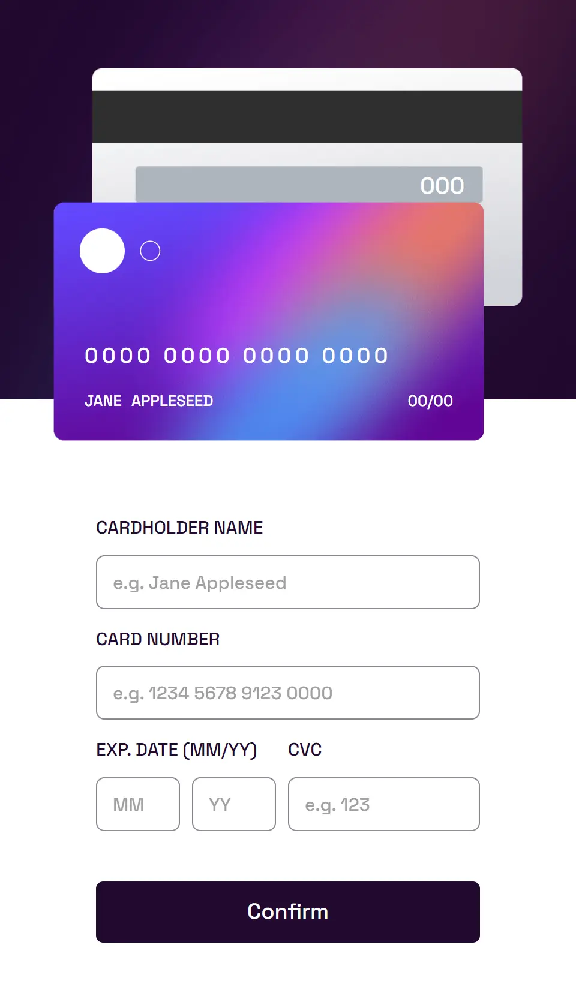
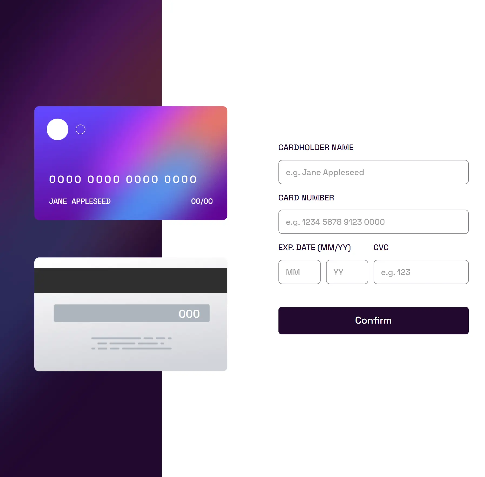
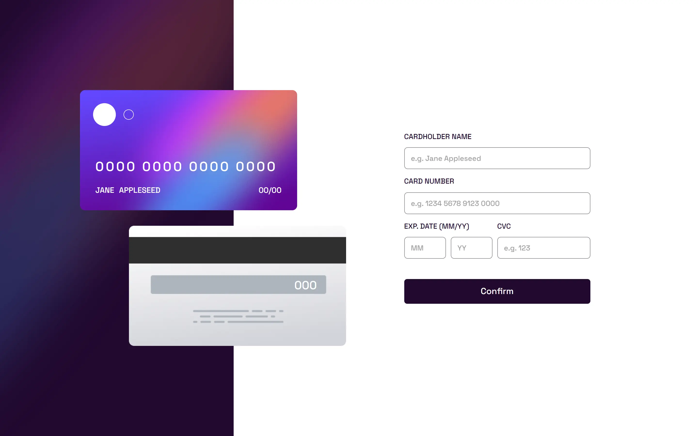

# Frontend Mentor - Interactive card details form solution

This is a solution to the [Interactive card details form challenge on Frontend Mentor](https://www.frontendmentor.io/challenges/interactive-card-details-form-XpS8cKZDWw). Frontend Mentor challenges help you improve your coding skills by building realistic projects.

[Solution][solution-url] . [Live Page][live-page]

Table of contents

-   [Overview](#overview)
    -   [The challenge](#the-challenge)
    -   [Screenshots](#screenshots)
    -   [Links](#links)
-   [My process](#my-process)
    -   [Built with](#built-with)
    -   [What I learned](#what-i-learned)
-   [Author](#author)

## Overview

### The challenge

Users should be able to:

-   Fill in the form and see the card details update in real-time
-   Receive error messages when the form is submitted if:
    -   Any input field is empty
    -   The card number, expiry date, or CVC fields are in the wrong format
-   View the optimal layout depending on their device's screen size
-   See hover, active, and focus states for interactive elements on the page

#### Expected behaviour

-   Update the details on the card as the user fills in the fields
-   Validate the form fields when the form is submitted
-   If there are no errors, display the completed state
-   Reset the form when the user clicks "Continue" on the completed state

### Screenshots

<table>
        <tr>
		    <td>
                
            </td>
			            <td>
                
            </td>
            <td>
                
            </td>
        </tr>
</table>

### Links

-   [Solution][solution-url]
-   [Live Page][live-page]

## My process

### Built with

-   Semantic HTML5 markup
-   CSS custom properties
-   Flexbox
-   Desktop-first workflow
-   [React](https://reactjs.org/) - JS library
-   [Vite](https://interactive-card-details-form.vercel.app/)

(<a href="#top">back to top</a>)

### What I learned

This challenge was a great learning opportunity, it was also very useful to reinforce previous knowledge, and face problems that had not been presented to me before.

(<a href="#top">back to top</a>)

## Author

-   Instagram - [@cosmo_art0](https://www.instagram.com/cosmo_art0/)
-   Frontend Mentor - [@CosmoArt](https://www.frontendmentor.io/profile/cosmoart)
-   Twitter - [@CosmoArt0](https://twitter.com/cosmoart0)
-   My personal page - [https://cosmoart.vercel.app](https://cosmoart.vercel.app)

(<a href="#top">back to top</a>)

[live-page]: https://interactive-card-details-form.vercel.app
[solution-url]: https://www.frontendmentor.io/solutions/interactive-card-details-form-solution-tKY7SrfIs_
